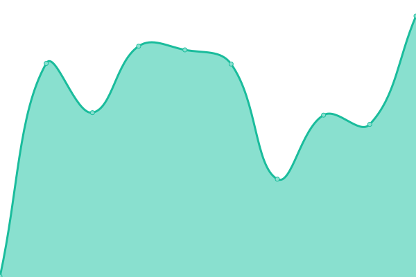
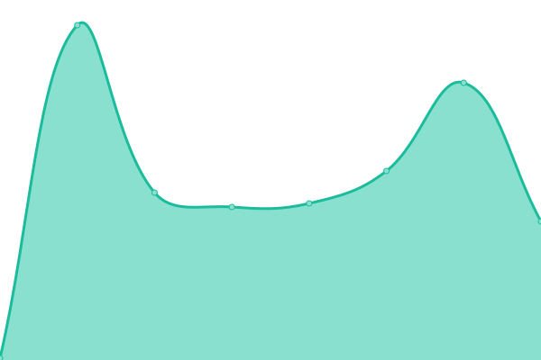

# [📈 Live Status](https://nengineer.github.io/upptime): <!--live status--> **🟩 All systems operational**

This repository contains the open-source uptime monitor and status page for [DavidV](https://nengineer.github.io/upptime), powered by [Upptime](https://github.com/upptime/upptime).

With [Upptime](https://upptime.js.org), you can get your own unlimited and free uptime monitor and status page, powered entirely by a GitHub repository. We use [Issues](https://github.com/nengineer/upptime/issues) as incident reports, [Actions](https://github.com/nengineer/upptime/actions) as uptime monitors, and [Pages](https://nengineer.github.io/upptime) for the status page.

<!--start: status pages-->
<!-- This summary is generated by Upptime (https://github.com/upptime/upptime) -->
<!-- Do not edit this manually, your changes will be overwritten -->
<!-- prettier-ignore -->
| URL | Status | History | Response Time | Uptime |
| --- | ------ | ------- | ------------- | ------ |
|  [absoluterecompgyms.com](http://absoluterecompgyms.com) | 🟩 Up | [absoluterecompgyms-com.yml](https://github.com/nengineer/TestMonitor/commits/HEAD/history/absoluterecompgyms-com.yml) | 

 379ms
     
 | 

<a href="https://nengineer.github.io/TestMonitor/history/absoluterecompgyms-com">99.52%</a>
    

|  [blendx.com](http://blendx.com) | 🟩 Up | [blendx-com.yml](https://github.com/nengineer/TestMonitor/commits/HEAD/history/blendx-com.yml) | 

 370ms
     
 | 

<a href="https://nengineer.github.io/TestMonitor/history/blendx-com">100.00%</a>
    

|  [franchise.stretchzone.com](http://franchise.stretchzone.com) | 🟩 Up | [franchise-stretchzone-com.yml](https://github.com/nengineer/TestMonitor/commits/HEAD/history/franchise-stretchzone-com.yml) | 

 354ms
     
 | 

<a href="https://nengineer.github.io/TestMonitor/history/franchise-stretchzone-com">100.00%</a>
    

|  [franchise2.stretchzone.com](http://franchise2.stretchzone.com) | 🟩 Up | [franchise2-stretchzone-com.yml](https://github.com/nengineer/TestMonitor/commits/HEAD/history/franchise2-stretchzone-com.yml) | 

 417ms
     
 | 

<a href="https://nengineer.github.io/TestMonitor/history/franchise2-stretchzone-com">100.00%</a>
    

|  [intrannuity.com](http://intrannuity.com) | 🟩 Up | [intrannuity-com.yml](https://github.com/nengineer/TestMonitor/commits/HEAD/history/intrannuity-com.yml) | 

 357ms
     
 | 

<a href="https://nengineer.github.io/TestMonitor/history/intrannuity-com">100.00%</a>
    

|  [knetk.io](http://knetk.io) | 🟩 Up | [knetk-io.yml](https://github.com/nengineer/TestMonitor/commits/HEAD/history/knetk-io.yml) | 

 509ms
     
 | 

<a href="https://nengineer.github.io/TestMonitor/history/knetk-io">100.00%</a>
    

|  [stretchzone.ca](http://stretchzone.ca) | 🟩 Up | [stretchzone-ca.yml](https://github.com/nengineer/TestMonitor/commits/HEAD/history/stretchzone-ca.yml) | 

 479ms
     
 | 

<a href="https://nengineer.github.io/TestMonitor/history/stretchzone-ca">100.00%</a>
    

|  [stretchzone.com](http://stretchzone.com) | 🟩 Up | [stretchzone-com.yml](https://github.com/nengineer/TestMonitor/commits/HEAD/history/stretchzone-com.yml) | 

 447ms
     
 | 

<a href="https://nengineer.github.io/TestMonitor/history/stretchzone-com">100.00%</a>
    

|  [try.stretchzone.com](http://try.stretchzone.com) | 🟩 Up | [try-stretchzone-com.yml](https://github.com/nengineer/TestMonitor/commits/HEAD/history/try-stretchzone-com.yml) | 

 335ms
     
 | 

<a href="https://nengineer.github.io/TestMonitor/history/try-stretchzone-com">100.00%</a>
    

|  [Google](https://www.google.com) | 🟩 Up | [google.yml](https://github.com/nengineer/TestMonitor/commits/HEAD/history/google.yml) | 

 159ms
     
 | 

<a href="https://nengineer.github.io/TestMonitor/history/google">100.00%</a>
    

|  [Wikipedia](https://en.wikipedia.org) | 🟩 Up | [wikipedia.yml](https://github.com/nengineer/TestMonitor/commits/HEAD/history/wikipedia.yml) | 

 215ms
     
 | 

<a href="https://nengineer.github.io/TestMonitor/history/wikipedia">100.00%</a>
    

|  [Hacker News](https://news.ycombinator.com) | 🟩 Up | [hacker-news.yml](https://github.com/nengineer/TestMonitor/commits/HEAD/history/hacker-news.yml) | 

 329ms
     
 | 

<a href="https://nengineer.github.io/TestMonitor/history/hacker-news">100.00%</a>
    

<!--end: status pages-->

[**Visit our status website →**](https://nengineer.github.io/upptime)

## 📄 License

- Powered by: [Upptime](https://github.com/upptime/upptime)
- Code: [MIT](./LICENSE) © [Anand Chowdhary](https://anandchowdhary.com), supported by [Pabio](https://pabio.com)
- Data in the `./history` directory: [Open Database License](https://opendatacommons.org/licenses/odbl/1-0/)
